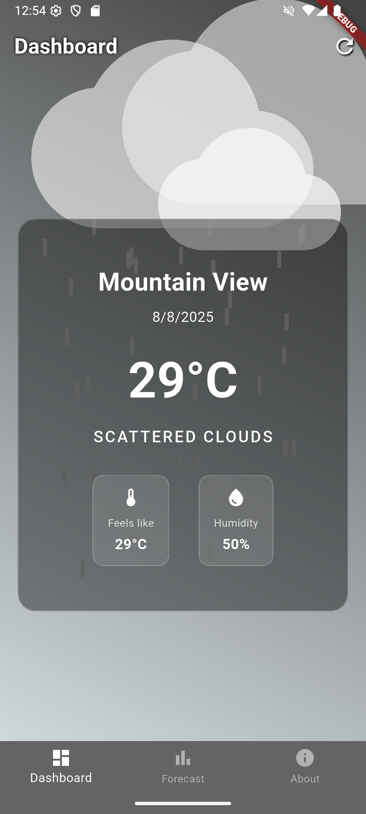
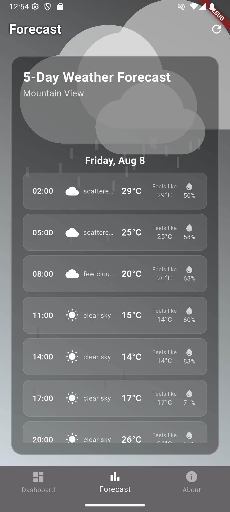
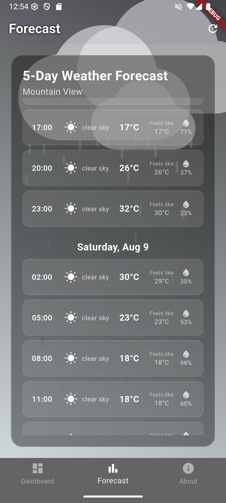
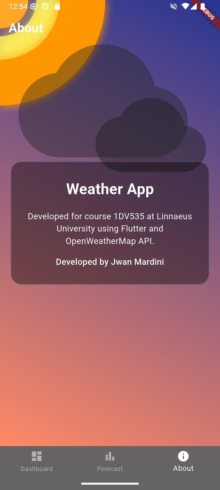

# Weather Project

A cross-platform Flutter app that provides real-time weather information and forecasts for your location. The app features a clean UI, animated backgrounds, and easy navigation between dashboard, forecast, and about screens.

## Features

- Current weather data for your city
- 5-day weather forecast
- Animated weather backgrounds

## Screenshots

Below are screenshots of the main screens:

### Dashboard


### Forecast



### About


## Getting Started

1. **Clone the repository:**
	```sh
	git clone https://github.com/yourusername/weather_project.git
	cd weather_project
	```

2. **Install dependencies:**
	```sh
	flutter pub get
	```

3. **Set up environment variables:**
	Edit `lib/env.dart` and add your OpenWeather API key:
	```dart
	const OPENWEATHER_API_KEY = 'YOUR_API_KEY_HERE';
	const OPENWEATHER_API_URL = 'https://api.openweathermap.org/data/2.5/weather?';
	const OPENWEATHER_FORECAST_API_URL = 'https://api.openweathermap.org/data/2.5/forecast?';
	```

4. **Run the app:**
	```sh
	flutter run
	```

## Environment Variables

The API keys and URLs are stored in `lib/env.dart`:

```dart
const OPENWEATHER_API_KEY = 'YOUR_API_KEY_HERE';
const OPENWEATHER_API_URL = 'https://api.openweathermap.org/data/2.5/weather?';
const OPENWEATHER_FORECAST_API_URL = 'https://api.openweathermap.org/data/2.5/forecast?';
```

Replace `'YOUR_API_KEY_HERE'` with your actual OpenWeather API key.

## License

This project is licensed under the MIT License.
